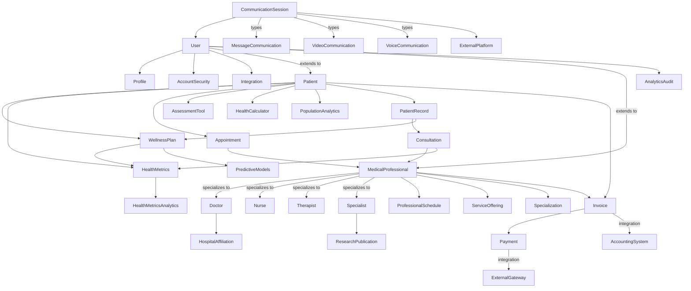

# Health Connect Model Interactions

## Models Interactions

```mermaid
graph TD
    User --> Profile
    User --> AccountSecurity
    User --> Integration
    User -->|extends to| Patient
    User -->|extends to| MedicalProfessional
    MedicalProfessional -->|specializes to| Doctor
    MedicalProfessional -->|specializes to| Nurse
    MedicalProfessional -->|specializes to| Therapist
    MedicalProfessional -->|specializes to| Specialist
    
    MedicalProfessional --> ProfessionalSchedule
    MedicalProfessional --> ServiceOffering
    MedicalProfessional --> Specialization
    Doctor --> HospitalAffiliation
    Specialist --> ResearchPublication
    
    Patient --> WellnessPlan
    Patient --> HealthMetrics
    Patient --> Appointment
    WellnessPlan --> HealthMetrics
    Appointment --> MedicalProfessional
    Patient --> AssessmentTool
    Patient --> HealthCalculator
    
    CommunicationSession --> User
    CommunicationSession -->|types| MessageCommunication
    CommunicationSession -->|types| VideoCommunication
    CommunicationSession -->|types| VoiceCommunication
    CommunicationSession --> ExternalPlatform
    
    HealthMetrics --> HealthMetricsAnalytics
    Patient --> PopulationAnalytics
    WellnessPlan --> PredictiveModels
    User --> AnalyticsAudit
    
    Patient --> PatientRecord
    PatientRecord --> Consultation
    Consultation --> MedicalProfessional
    PatientRecord --> WellnessPlan
    Consultation --> HealthMetrics
    
    Patient --> Invoice
    MedicalProfessional --> Invoice
    Invoice --> Payment
    Payment -->|integration| ExternalGateway
    Invoice -->|integration| AccountingSystem
```