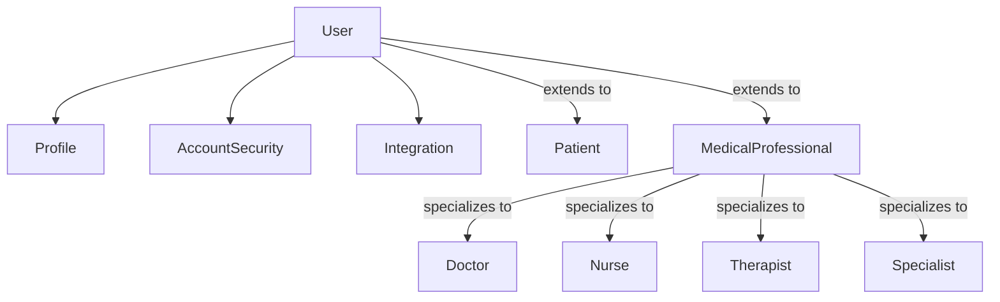
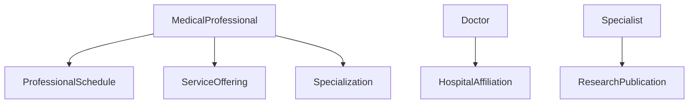
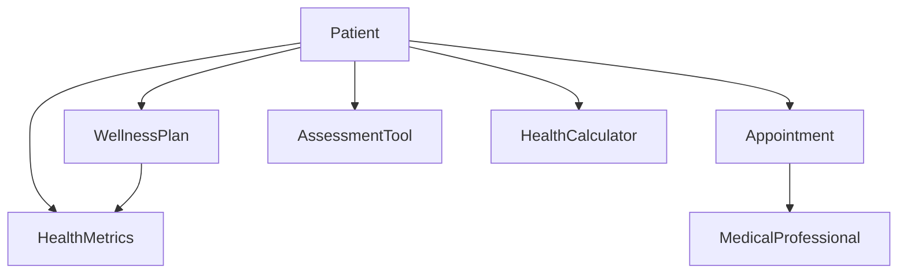
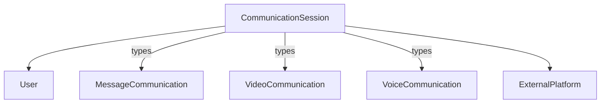
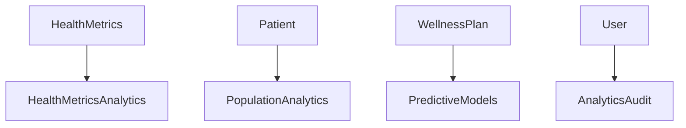
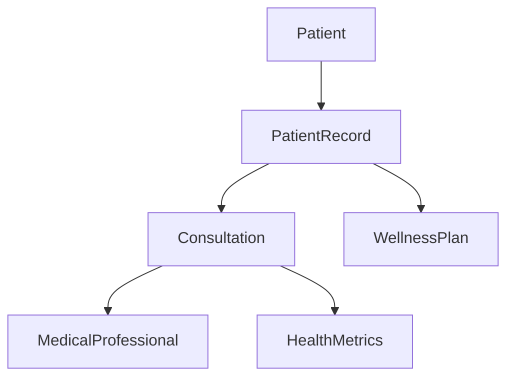
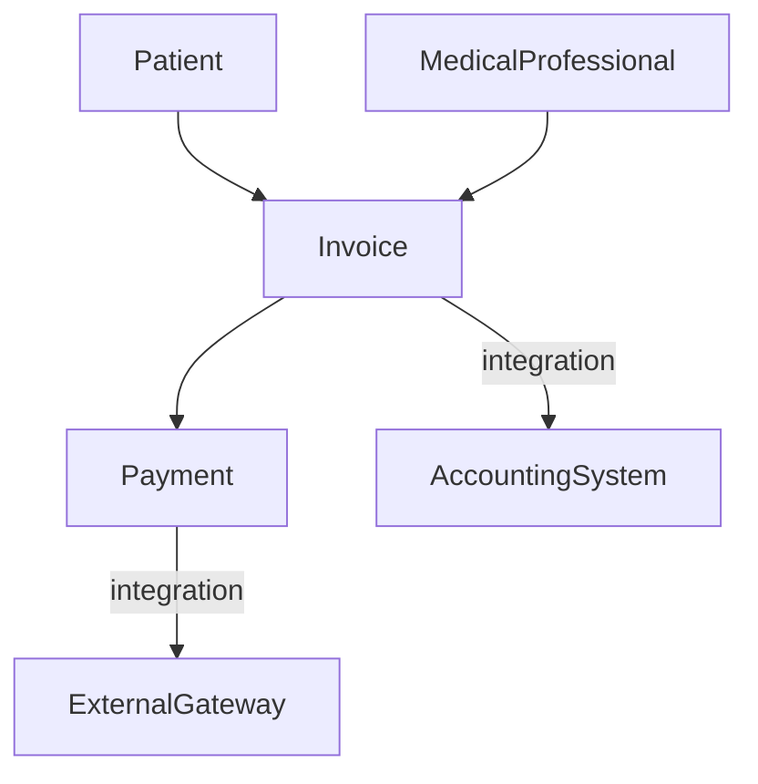

# Health Connect Model Relationships

## Core User Management

## Healthcare Provider Relationships

## Patient Care Flow

## Communication Framework

## Analytics Integration

## Medical Records Flow

## Billing Framework

## Key Cross-App Dependencies

### User-Centric Models
- User is the central entity connecting all user types (patients, providers)
- Profile stores common personal information
- AccountSecurity manages authentication and authorization
- Integration handles external service connections

### Medical Professional Framework
- MedicalProfessional is the base model for all healthcare providers
- Specialized provider types extend from MedicalProfessional
- Professional details (schedule, services, specializations) link to MedicalProfessional

### Patient Care Models
- WellnessPlan and HealthMetrics form the core of patient health tracking
- Appointments connect patients with providers
- Tools (calculators, assessments) support patient care

### Communication Structure
- CommunicationSession is the base for all communication types
- External platform integrations handle third-party services
- Messages, video, and voice extend the base session

### Analytics Layer
- Analytics models observe and analyze data from all other models
- Audit trails track system usage and changes
- Predictive models integrate with patient care data

### Medical Records Framework
- PatientRecord maintains complete medical history
- Consultation records link patients and providers
- Records integrate with wellness plans and metrics

### Billing Structure
- Invoice tracks billable services and payments
- Payment processes handle multiple gateways
- Integration with accounting systems planned

## Future Integration Points
- EHR/EMR system connections
- Telemedicine platform integration
- Wearable device data integration
- AI/ML model integration
- External analytics platforms

## Data Flow Considerations
- Patient privacy and data segregation
- Audit trail requirements
- Performance optimization
- Compliance requirements
- Scale and growth planning

## Note
This relationship diagram represents the core model interactions.
Additional relationships may be established as new features
are implemented or existing ones are enhanced.
